> 在线视频：https://www.bilibili.com/video/BV1VP4y1c7j7
>
> 百度网盘：[尚硅谷2022版MyBatis教程](https://pan.baidu.com/s/1Y4K8zAcABJe5egHcP5PGNQ?pwd=yyds)
>
> 阿里云盘：[尚硅谷2022版MyBatis教程（仅视频）](https://www.aliyundrive.com/s/jhn918RtGjA)
>
> Gitee：https://gitee.com/an_shiguang/learn-mybatis/
>
> GitHub：https://github.com/Shiguang-coding/learn-mybatis/

# MyBatis 简介

## MyBatis历史

MyBatis最初是Apache的一个开源项目iBatis, 2010年6月这个项目由Apache Software Foundation迁 移到了Google Code。随着开发团队转投Google Code旗下， iBatis3.x正式更名为MyBatis。代码于 2013年11月迁移到Github。 iBatis一词来源于“internet”和“abatis”的组合，是一个基于Java的持久层框架。 iBatis提供的持久层框架 包括SQL Maps和Data Access Objects（DAO）。

## MyBatis特性

1. MyBatis 是支持定制化 SQL、存储过程以及高级映射的优秀的持久层框架 
2. MyBatis 避免了几乎所有的 JDBC 代码和手动设置参数以及获取结果集 
3. MyBatis可以使用简单的XML或注解用于配置和原始映射，将接口和Java的POJO（Plain Old Java Objects，普通的Java对象）映射成数据库中的记录 
4. MyBatis 是一个 半自动的ORM（Object Relation Mapping）框架

## MyBatis 下载

MyBatis下载地址：https://github.com/mybatis/mybatis-3

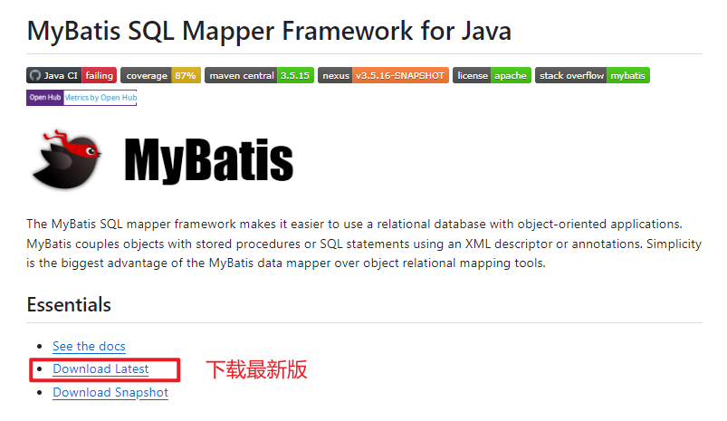


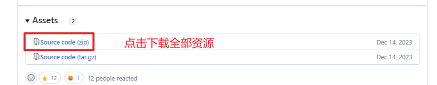

##  和其它持久化层技术对比

- JDBC 

  - SQL 夹杂在Java代码中耦合度高，导致硬编码内伤

  - 维护不易且实际开发需求中 SQL 有变化，频繁修改的情况多见
  - 代码冗长，开发效率低
- Hibernate 和 JPA
  - 操作简便，开发效率高 
  - 程序中的长难复杂 SQL 需要绕过框架 
  - 内部自动生产的 SQL，不容易做特殊优化 
  - 基于全映射的全自动框架，大量字段的 POJO 进行部分映射时比较困难。
  - 反射操作太多，导致数据库性能下降
- MyBatis
  - 轻量级，性能出色 
  - SQL 和 Java 编码分开，功能边界清晰。Java代码专注业务、SQL语句专注数据 
  - 开发效率稍逊于HIbernate，但是完全能够接受

# 搭建MyBatis

## 开发环境 

IDE：idea 2033.3 

构建工具：maven 3.6.3

MySQL版本：MySQL 8

MyBatis版本：MyBatis 3.5.7

## 创建maven工程

###  创建一个空项目

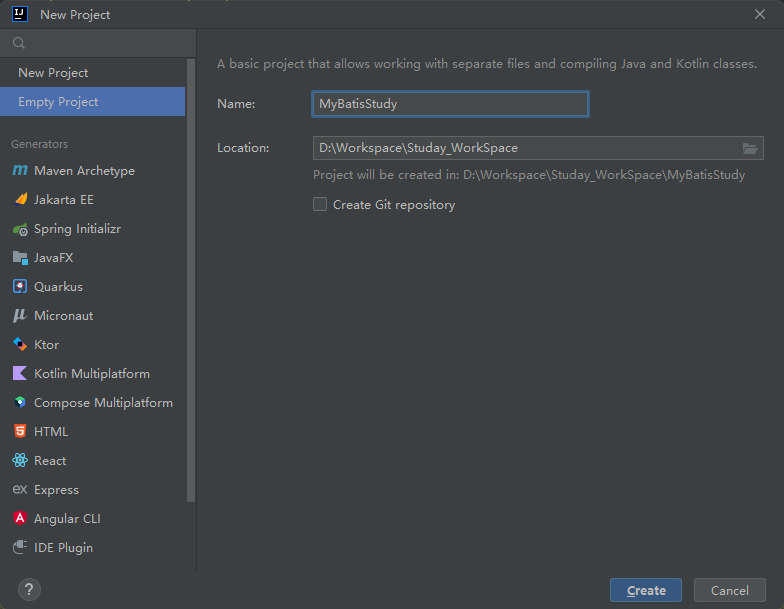

### 配置 jdk及相应版本

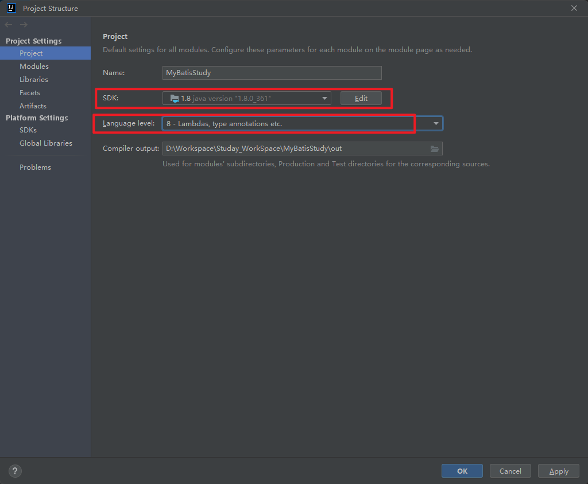

### Maven配置设置

`File => Settings => Build,Execution,Deployment => Build Tools => Maven`

选择本地Maven进行配置

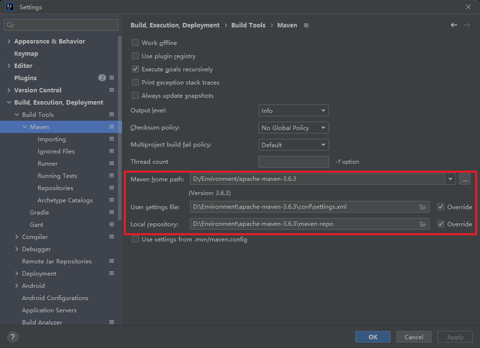

>  Maven下载依赖步骤：
>
> 先在本地仓库查找，若本地仓库没有，则看配置文件中是否配置镜像网站，若已配置则从镜像网站拉取，反之从中央仓库拉取

### 创建Maven工程

`New => Module`

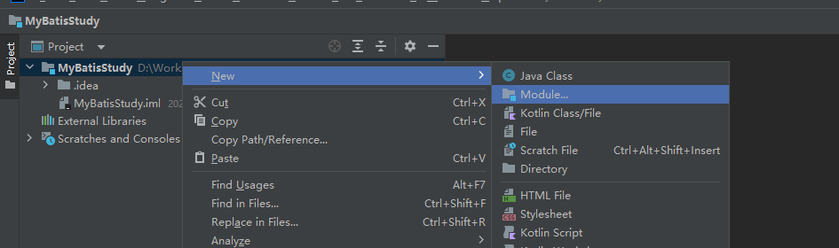

可以选择 `Maven Archetype`的方式创建，即选择不同的模板进行创建

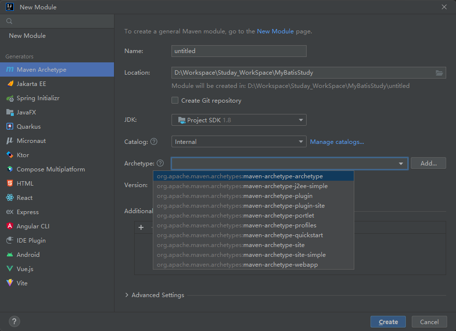

也可以直接创建java项目

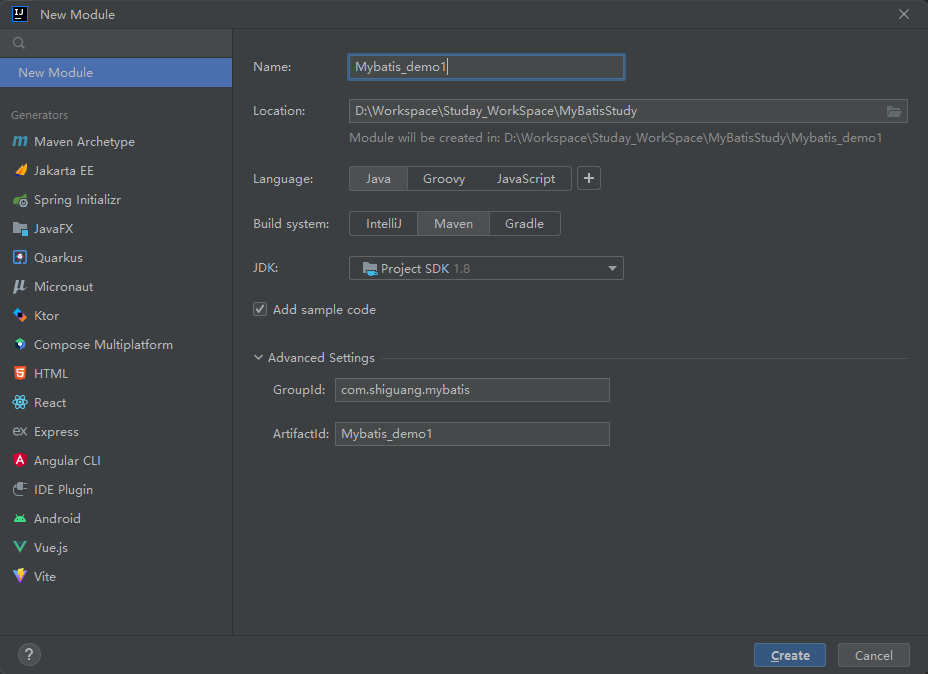

创建好后目录结果如图所示

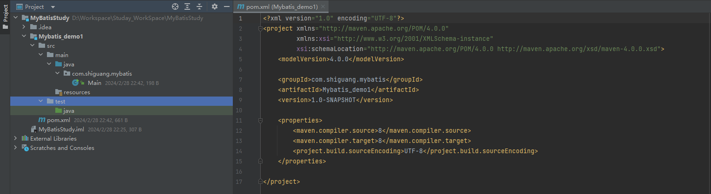

####  设置打包方式：jar

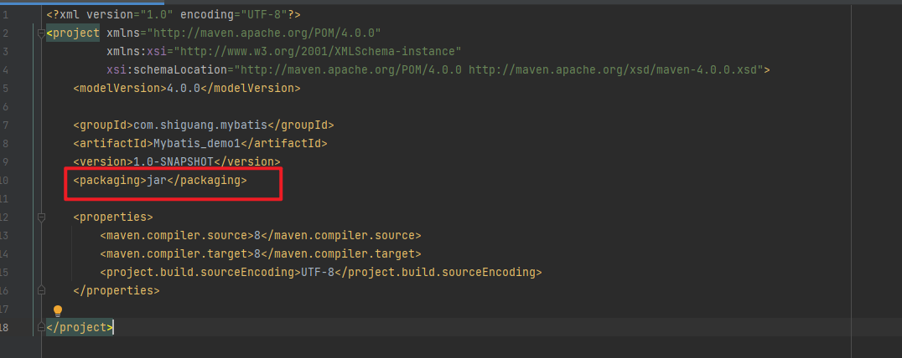

####  引入依赖

可从 [Maven仓库](https://mvnrepository.com/) 查看依赖最新版本

```xml
<dependencies>
        <!-- Mybatis核心 -->
        <dependency>
            <groupId>org.mybatis</groupId>
            <artifactId>mybatis</artifactId>
            <version>3.5.7</version>
        </dependency>
        <!-- junit测试 -->
        <dependency>
            <groupId>junit</groupId>
            <artifactId>junit</artifactId>
            <version>4.13.2</version>
            <scope>test</scope>
        </dependency>
        <!-- MySQL驱动 -->
        <dependency>
            <groupId>mysql</groupId>
            <artifactId>mysql-connector-java</artifactId>
            <version>8.0.33</version>
        </dependency>
        <!-- lombok依赖 -->
        <dependency>
            <groupId>org.projectlombok</groupId>
            <artifactId>lombok</artifactId>
            <version>1.18.24</version>
            <!-- 对于编译时注解处理器，通常设置为 provided -->
            <scope>provided</scope>
        </dependency>
    	 <!-- log4j日志 -->
        <dependency>
            <groupId>log4j</groupId>
            <artifactId>log4j</artifactId>
            <version>1.2.17</version>
        </dependency>
    </dependencies>
```

点击Maven小图片可更新依赖

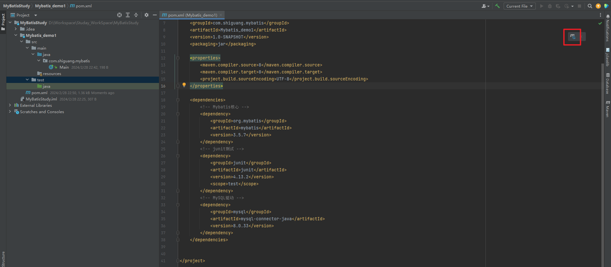

或者在Maven侧边栏进行操作

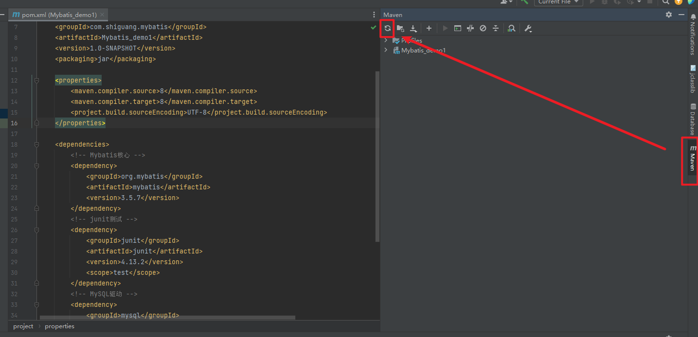

也可在此处查看引入的相关依赖

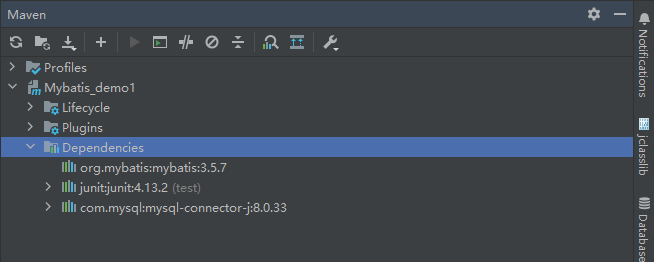

## 创建Mybatis核心配置文件

> 习惯上命名为mybatis-config.xml，这个文件名仅仅只是建议，并非强制要求。将来整合Spring 之后，这个配置文件可以省略，所以大家操作时可以直接复制、粘贴。 核心配置文件主要用于配置连接数据库的环境以及MyBatis的全局配置信息
>
> 核心配置文件存放的位置是src/main/resources目录下

3.1、创建`mybatis-config.xml`核心配置文件

```xml
<?xml version="1.0" encoding="UTF-8" ?>
<!DOCTYPE configuration
        PUBLIC "-//mybatis.org//DTD Config 3.0//EN"
        "http://mybatis.org/dtd/mybatis-3-config.dtd">
<!-- Spring中约束使用xsd约束,MyBatis使用dtd约束,dtd约束中 DOCTYPE 后的标签必定为当前配置文件中的根标签 -->
<configuration>
    <!--设置连接数据库的环境,可配置多个连接数据库的环境信息-->
    <environments default="development">
        <environment id="development">
            <!-- 事务管理器,以最原始的JDBC方式进行管理,事务的开启,提交,回滚需手动处理 -->
            <transactionManager type="JDBC"/>
            <!-- 数据源 连接数据库的信息   type="POOLED" 表示使用数据库连接池,会对当前的数据库连接进行保存,下次使用时可直接从缓存中获取 -->
            <dataSource type="POOLED">
                <!-- 驱动名称  mysql8之前版本： com.mysql.jdbc.Driver mysql8之后：com.mysql.cj.jdbc.Driver -->
<!--                <property name="driver" value="com.mysql.jdbc.Driver"/>-->
                <property name="driver" value="com.mysql.cj.jdbc.Driver"/>
                <!-- 连接地址 mysql8 之后需指定时区 GMT%2B8 或 Asia/Shanghai -->
<!--                <property name="url" value="jdbc:mysql://localhost:3306/MyBatis"/>-->
                <property name="url" value="jdbc:mysql://localhost:3306/MyBatis?useUnicode=true&amp;characterEncoding=UTF8&amp;serverTimezone=Asia/Shanghai&amp;useSSL=false"/>
                <!-- 用户名 -->
                <property name="username" value="root"/>
                <!-- 登录密码 -->
                <property name="password" value="123456"/>
            </dataSource>
        </environment>
    </environments>
    <!--引入映射文件-->
    <mappers>
        <mapper resource="mappers/UserMapper.xml"/>
    </mappers>
</configuration>
```

## 创建Mapper接口

> MyBatis中的mapper接口相当于以前的dao。但是区别在于，mapper仅仅是接口，我们不需要 提供实现类。

### 创建表

```sql
/*
 Navicat Premium Data Transfer

 Source Server         : MYSQL8.0.31
 Source Server Type    : MySQL
 Source Server Version : 80031
 Source Host           : localhost:3306
 Source Schema         : mybatis

 Target Server Type    : MySQL
 Target Server Version : 80031
 File Encoding         : 65001

 Date: 28/02/2024 23:21:56
*/

SET NAMES utf8mb4;
SET FOREIGN_KEY_CHECKS = 0;

-- ----------------------------
-- Table structure for t_user
-- ----------------------------
DROP TABLE IF EXISTS `t_user`;
CREATE TABLE `t_user`  (
  `id` int NOT NULL AUTO_INCREMENT,
  `username` varchar(255) CHARACTER SET utf8mb4 COLLATE utf8mb4_general_ci NULL DEFAULT NULL,
  `password` varchar(255) CHARACTER SET utf8mb4 COLLATE utf8mb4_general_ci NULL DEFAULT NULL,
  `age` int NULL DEFAULT NULL,
  `sex` char(1) CHARACTER SET utf8mb4 COLLATE utf8mb4_general_ci NULL DEFAULT NULL,
  `email` varchar(255) CHARACTER SET utf8mb4 COLLATE utf8mb4_general_ci NULL DEFAULT NULL,
  PRIMARY KEY (`id`) USING BTREE
) ENGINE = InnoDB AUTO_INCREMENT = 6 CHARACTER SET = utf8mb4 COLLATE = utf8mb4_general_ci ROW_FORMAT = Dynamic;

-- ----------------------------
-- Records of t_user
-- ----------------------------
INSERT INTO `t_user` VALUES (3, '张三', '123', 18, '男', 'zhangsan@shiguangteach.com');
INSERT INTO `t_user` VALUES (4, '李四', 'lisi', 18, '男', 'lisi@shiguangteach.com');
INSERT INTO `t_user` VALUES (5, '王五', 'wangwu', 20, '男', 'wangwu@shiguangteach.com');

SET FOREIGN_KEY_CHECKS = 1;

```

### 创建实体类

```java
package com.shiguang.mybatis.pojo;

import lombok.AllArgsConstructor;
import lombok.Data;
import lombok.NoArgsConstructor;
import lombok.ToString;


@Data
@NoArgsConstructor
@AllArgsConstructor
@ToString
public class User {
    private Integer id;
    private String username;
    private String password;
    private Integer age;
    private String email;
    private String sex;
}

```

### 创建Mapper接口

> Mybatis 面向接口编程的两个一致
>  1、映射文件的namespace要和mapper接口的全类名保持一致
>  2、映射文件中SQL语句的id要和mapper接口中的方法名一致

`src/main/java/com/shiguang/mybatis/mapper/UserMapper.java`

```java
package com.shiguang.mybatis.mapper;


/**
 * Created By AnShiGuang329 On 2024/1/16 22:31
 */
public interface UserMapper {
    /**
     * Mybatis 面向接口编程的两个一致
     * 1、映射文件的namespace要和mapper接口的全类名保持一致
     * 2、映射文件中SQL语句的id要和mapper接口中的方法名一致
     */

    /**
     * 添加用户信息
     */
    int insertUser();


}

```


# MyBatis增删改查

## 创建MyBatis的映射文件

相关概念：**ORM（Object Relationship Mapping）**对象关系映射。 

- 对象：Java的实体类对象 
- 关系：关系型数据库 
- 映射：二者之间的对应关系


| Java概念 | 数据库概念 |
| -------- | ---------- |
| 类       | 表         |
| 属性     | 字段/列    |
| 对象     | 记录/行    |


## 创建xml映射文件

>1、映射文件的命名规则： 
>
>表所对应的实体类的类名+Mapper.xml 
>
>例如：表t_user，映射的实体类为User，所对应的映射文件为UserMapper.xml 
>
>因此一个映射文件对应一个实体类，对应一张表的操作
>
> MyBatis映射文件用于编写SQL，访问以及操作表中的数据 
>
>MyBatis映射文件存放的位置是src/main/resources/mappers目录下 
>
>2、MyBatis中可以面向接口操作数据，要保证两个一致：
>
> a >mapper接口的全类名和映射文件的命名空间（namespace）保持一致 
>
> b >mapper接口中方法的方法名和映射文件中编写SQL的标签的id属性保持一致

`mappers/UserMapper.xml`

```xml
<?xml version="1.0" encoding="UTF-8" ?>
<!DOCTYPE mapper
        PUBLIC "-//mybatis.org//DTD Mapper 3.0//EN"
        "http://mybatis.org/dtd/mybatis-3-mapper.dtd">
<mapper namespace="com.shiguang.mybatis.mapper.UserMapper">


    <insert id="insertUser">
        insert into t_user values (null, '王铁成', 'wangwu', 10, '男', 'wangwu@shiguangteach.com')
    </insert>

</mapper>

```

## 测试新增功能

`src/test/java/MyBatisTest.java`

```java
import com.shiguang.mybatis.mapper.UserMapper;
import org.apache.ibatis.io.Resources;
import org.apache.ibatis.session.SqlSession;
import org.apache.ibatis.session.SqlSessionFactory;
import org.apache.ibatis.session.SqlSessionFactoryBuilder;
import org.junit.Test;

import java.io.IOException;
import java.io.InputStream;

public class MyBatisTest {
    @Test
    public void testMyBatis() throws IOException {
        // 加载核心配置文件
        InputStream is = Resources.getResourceAsStream("mybatis-config.xml");

        // 获取SqlSessionFactoryBuilder
        SqlSessionFactoryBuilder sqlSessionFactoryBuilder = new SqlSessionFactoryBuilder();

        // 获取SqlSessionFactory
        // 通过核心配置文件所对应的字节输入流创建工厂类SqlSessionFactory，生产SqlSession对象
        SqlSessionFactory sqlSessionFactory = sqlSessionFactoryBuilder.build(is);

        //获取SqlSession
        //sqlSessionFactory.openSession() 默认不会开启事务,需执行完sql后调用commit()方法手动提交
        // sqlSessionFactory.openSession(true)  开启自动提交事务
        SqlSession sqlSession = sqlSessionFactory.openSession(true);

        //获取mapper接口对象
        ///通过代理模式创建UserMapper接口的代理实现类对象
        UserMapper mapper = sqlSession.getMapper(UserMapper.class);


        //测试功能


        //调用UserMapper接口中的方法，就可以根据UserMapper的全类名匹配元素文件，
        // 通过调用的方法名匹配 映射文件中的SQL标签，并执行标签中的SQL语句
        int resultCode = mapper.insertUser();
        System.out.println("resultCode:" + resultCode);

        //提交事务
//        sqlSession.commit();

    }

}

```

## 加入log4j日志功能

### 导入依赖

```
<!-- log4j日志 -->
<dependency>
<groupId>log4j</groupId>
<artifactId>log4j</artifactId>
<version>1.2.17</version>
</dependency>
```

### log4j的配置文件

> log4j的配置文件名为log4j.xml，存放的位置是src/main/resources目录下

```xml
<?xml version="1.0" encoding="UTF-8" ?>
<!DOCTYPE log4j:configuration SYSTEM "log4j.dtd">
<log4j:configuration xmlns:log4j="http://jakarta.apache.org/log4j/">
    <appender name="STDOUT" class="org.apache.log4j.ConsoleAppender">
        <param name="Encoding" value="UTF-8"/>
        <layout class="org.apache.log4j.PatternLayout">
            <param name="ConversionPattern" value="%-5p %d{MM-dd HH:mm:ss,SSS}
%m (%F:%L) \n"/>
        </layout>
    </appender>
    <logger name="java.sql">
        <level value="debug"/>
    </logger>
    <logger name="org.apache.ibatis">
        <level value="info"/>
    </logger>
    <root>
        <level value="debug"/>
        <appender-ref ref="STDOUT"/>
    </root>
</log4j:configuration>
```

文件中有一处报错可忽略

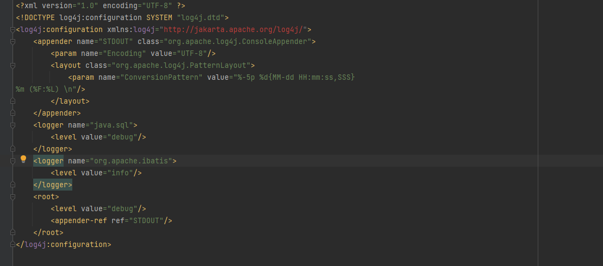

> 日志的级别 
>
> FATAL(致命)>ERROR(错误)>WARN(警告)>INFO(信息)>DEBUG(调试) 
>
> 从左到右打印的内容越来越详细
>
> 日志级别越高，输出的日志越少，日志级别越低，输出的日志越多

日志输出信息如下所示

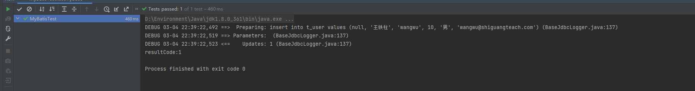

## 测试修改和删除功能

`UserMapper.java` 中新增相应方法

```java
    /**
     * 修改用户信息
     */
    int updateUser();


    /**
     * 删除用户信息
     */
    int deleteById();

```

` UserMapper.xml` 中新增相应sql

```xml
<!--    int updateUser();-->

    <update id="updateUser">
        update  t_user set  username = '赵磊' where  id = 8
    </update>


<!--    int deleteById();-->
    <delete id="deleteById">
        delete from  t_user where  id = 8
    </delete>
```

测试

```java
    @Test
    public void testUpdate() throws IOException {

        InputStream is = Resources.getResourceAsStream("mybatis-config.xml");

        SqlSessionFactoryBuilder sqlSessionFactoryBuilder = new SqlSessionFactoryBuilder();

        SqlSessionFactory sqlSessionFactory = sqlSessionFactoryBuilder.build(is);

        SqlSession sqlSession = sqlSessionFactory.openSession(true);

        UserMapper mapper = sqlSession.getMapper(UserMapper.class);

        //测试功能

        int resultCode = mapper.updateUser();
        System.out.println("resultCode:" + resultCode);


    }

    @Test
    public void testDelete() throws IOException {

        InputStream is = Resources.getResourceAsStream("mybatis-config.xml");

        SqlSessionFactoryBuilder sqlSessionFactoryBuilder = new SqlSessionFactoryBuilder();

        SqlSessionFactory sqlSessionFactory = sqlSessionFactoryBuilder.build(is);

        SqlSession sqlSession = sqlSessionFactory.openSession(true);

        UserMapper mapper = sqlSession.getMapper(UserMapper.class);

        //测试功能

        int resultCode = mapper.deleteById();
        System.out.println("resultCode:" + resultCode);

    }
```

## 测试查询功能

`UserMapper.java` 中新增相应方法

```java
    /**
     * 根据ID获取User对象
     */
    User getUserById();


    /**
     * 查询所有用户信息
     */
    List<User> getAllUser();
```

` UserMapper.xml` 中新增相应sql

```xml
   <!--User getUserById();-->
    <!--
        查询功能的标签必须设置resultType或resultMap
        resultType: 设置默认的映射关系
        resultMap: 设置自定义映射关系
      -->
    <select id="getUserById" resultType="com.shiguang.mybatis.pojo.User">
        select * from  t_user where  id = 3
    </select>


    <!--  List<User> getAllUser();  -->
    <select id="getAllUser" resultType="com.shiguang.mybatis.pojo.User">
        select * from  t_user
    </select>
```

测试

```java
    @Test
    public void testGetUserById() throws IOException {

        InputStream is = Resources.getResourceAsStream("mybatis-config.xml");

        SqlSessionFactoryBuilder sqlSessionFactoryBuilder = new SqlSessionFactoryBuilder();

        SqlSessionFactory sqlSessionFactory = sqlSessionFactoryBuilder.build(is);

        SqlSession sqlSession = sqlSessionFactory.openSession(true);

        UserMapper mapper = sqlSession.getMapper(UserMapper.class);

        //测试功能

        User user = mapper.getUserById();
        System.out.println(user);

    }

    @Test
    public void testGetAllUser() throws IOException {
        InputStream is = Resources.getResourceAsStream("mybatis-config.xml");

        SqlSessionFactoryBuilder sqlSessionFactoryBuilder = new SqlSessionFactoryBuilder();

        SqlSessionFactory sqlSessionFactory = sqlSessionFactoryBuilder.build(is);

        SqlSession sqlSession = sqlSessionFactory.openSession(true);

        UserMapper mapper = sqlSession.getMapper(UserMapper.class);

        //测试功能

        List<User> users = mapper.getAllUser();
//        users.forEach(user -> System.out.println(user));
        users.forEach(System.out::println);

    }
```

>注意：
>
>1、查询功能的标签必须设置resultType或resultMap
> resultType: 设置默认的映射关系，字段名与属性名一致时可使用resultType
> resultMap: 设置自定义映射关系，字段名与属性名不一致或者处理多对一，一对多关系需用resultMap
>
>2、当查询的数据为多条时，不能使用实体类作为返回值，只能使用集合，否则会抛出异常 TooManyResultsException；但是若查询的数据只有一条，可以使用实体类或集合作为返回值

若查询时未指定返回值类型会报错

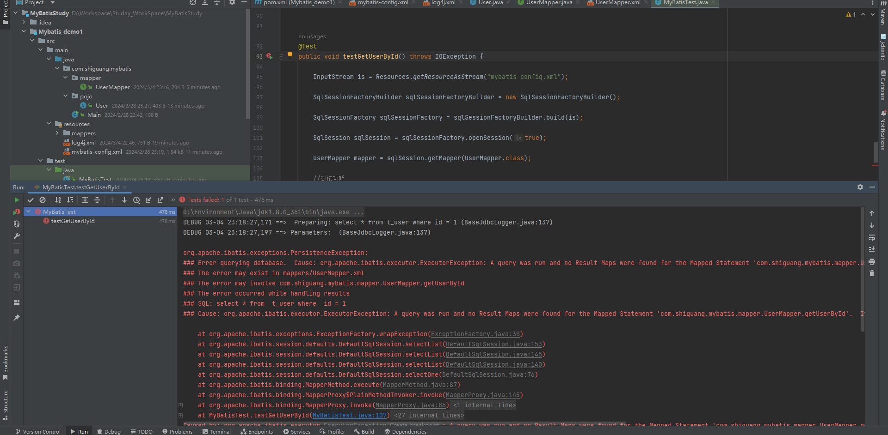


## Idea中创建文件模板

`File => Settings => Editor => File and Code templates => Files`

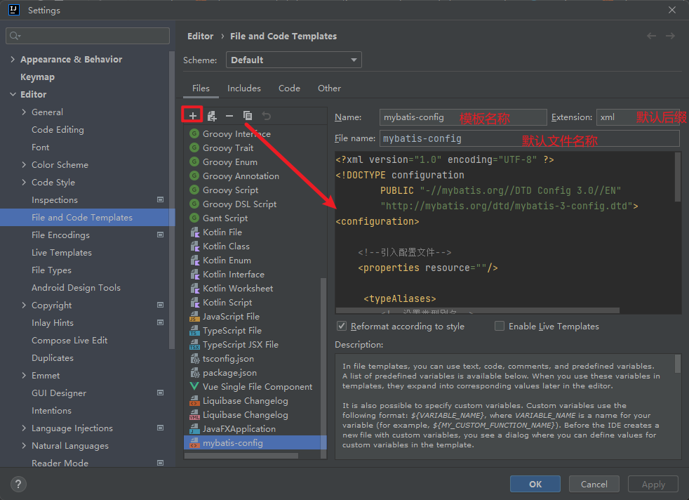


`mybatis-config.xml`模板如下

```xml
<?xml version="1.0" encoding="UTF-8" ?>
<!DOCTYPE configuration
        PUBLIC "-//mybatis.org//DTD Config 3.0//EN"
        "http://mybatis.org/dtd/mybatis-3-config.dtd">
<configuration>
    
    <!--引入配置文件-->
    <properties resource=""/>
    
     <typeAliases>
        <!--设置类型别名-->
        <package name=""/>
    </typeAliases>

    <environments default="development">
        <environment id="development">
            <transactionManager type="JDBC"/>
            <dataSource type="POOLED">
                <property name="driver" value="${jdbc.driver}"/>
                <property name="url" value="${jdbc.url}"/>
                <property name="username" value="${jdbc.username}"/>
                <property name="password" value="${jdbc.password}"/>
            </dataSource>
        </environment>
    </environments>
    <!--引入映射文件-->
    <mappers>
        <mapper resource=""/>
    </mappers>
</configuration>
```


`xxxMapper.xml` 模板如下

```xml
<?xml version="1.0" encoding="UTF-8" ?>
<!DOCTYPE mapper
        PUBLIC "-//mybatis.org//DTD Mapper 3.0//EN"
        "http://mybatis.org/dtd/mybatis-3-mapper.dtd">
<mapper namespace="">

</mapper>

```


使用时只需 `New => 选择相应文件模板` 即可快速创建

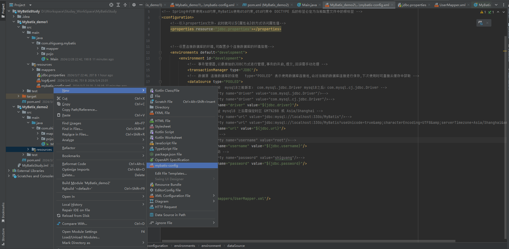

## 封装SqlSession工具类

```java
package com.shiguang.mybatis.utils;

import org.apache.ibatis.io.Resources;
import org.apache.ibatis.session.SqlSession;
import org.apache.ibatis.session.SqlSessionFactory;
import org.apache.ibatis.session.SqlSessionFactoryBuilder;

import java.io.IOException;
import java.io.InputStream;

public class SqlSessionUtils {
    public static SqlSession getSqlSession() {
        SqlSession sqlSession = null;
        try {
            InputStream is = Resources.getResourceAsStream("mybatis-config.xml");
            SqlSessionFactory sqlSessionFactory = new SqlSessionFactoryBuilder().build(is);
            sqlSession = sqlSessionFactory.openSession(true);

        } catch (IOException e) {
            throw new RuntimeException(e);
        }

        return sqlSession;
    }
}
```

# 核心配置文件详解

> 核心配置文件中的标签必须按照固定的顺序： properties?,settings?,typeAliases?,typeHandlers?,objectFactory?,objectWrapperFactory?,reflectorF actory?,plugins?,environments?,databaseIdProvider?,mappers?

```xml
<?xml version="1.0" encoding="UTF-8" ?>
<!DOCTYPE configuration
        PUBLIC "-//MyBatis.org//DTD Config 3.0//EN"
        "http://MyBatis.org/dtd/MyBatis-3-config.dtd">
<configuration>
    <!--引入properties文件，此时就可以${属性名}的方式访问属性值-->
    <properties resource="jdbc.properties"></properties>
    <settings>
        <!--将表中字段的下划线自动转换为驼峰-->
        <setting name="mapUnderscoreToCamelCase" value="true"/>
        <!--开启延迟加载-->
        <setting name="lazyLoadingEnabled" value="true"/>
    </settings>
    <typeAliases>
        <!--
        typeAlias：设置某个具体的类型的别名
        属性：
        type：需要设置别名的类型的全类名
        alias：设置此类型的别名，若不设置此属性，该类型拥有默认的别名，即类名且不区分大小
        写
        若设置此属性，此时该类型的别名只能使用alias所设置的值
        -->
        <!--<typeAlias type="com.atguigu.mybatis.bean.User"></typeAlias>-->
        <!--<typeAlias type="com.atguigu.mybatis.bean.User" alias="abc">
        </typeAlias>-->
        <!--以包为单位，设置改包下所有的类型都拥有默认的别名，即类名且不区分大小写-->
        <package name="com.atguigu.mybatis.bean"/>
    </typeAliases>
    <!--
    environments：设置多个连接数据库的环境
    属性：
    default：设置默认使用的环境的id
    -->
    <environments default="mysql_test">
        <!--
        environment：设置具体的连接数据库的环境信息
        属性：
        id：设置环境的唯一标识，可通过environments标签中的default设置某一个环境的id，
        表示默认使用的环境
        -->
        <environment id="mysql_test">
            <!--
            transactionManager：设置事务管理方式
            属性：
            type：设置事务管理方式，type="JDBC|MANAGED"
            type="JDBC"：设置当前环境的事务管理都必须手动处理
            type="MANAGED"：设置事务被管理，例如spring中的AOP
            -->
            <transactionManager type="JDBC"/>
            <!--
            dataSource：设置数据源
            属性：
            type：设置数据源的类型，type="POOLED|UNPOOLED|JNDI"
            type="POOLED"：使用数据库连接池，即会将创建的连接进行缓存，下次使用可以从
            缓存中直接获取，不需要重新创建
            type="UNPOOLED"：不使用数据库连接池，即每次使用连接都需要重新创建
            type="JNDI"：调用上下文中的数据源
            -->
            <dataSource type="POOLED">
                <!--设置驱动类的全类名-->
                <property name="driver" value="${jdbc.driver}"/>
                <!--设置连接数据库的连接地址-->
                <property name="url" value="${jdbc.url}"/>
                <!--设置连接数据库的用户名-->
                <property name="username" value="${jdbc.username}"/>
                <!--设置连接数据库的密码-->
                <property name="password" value="${jdbc.password}"/>
            </dataSource>
        </environment>
    </environments>
    <!--引入映射文件-->
    <mappers>
        <mapper resource="UserMapper.xml"/>
        <!--
        以包为单位，将包下所有的映射文件引入核心配置文件
        注意：此方式必须保证mapper接口和mapper映射文件必须在相同的包下
        -->
        <package name="com.atguigu.mybatis.mapper"/>
    </mappers>
</configuration>
```

## properties引入配置文件

新建 `jdbc.properties`配置文件 ，可以直接通过 `new => File`手动创建 `.properties` 后缀的配置文件，

也可通过 `new => Resource Bundle` 创建，通过该方式创建的后缀均为 `.properties`

文件路径为 `src/main/resources/jdbc.properties`

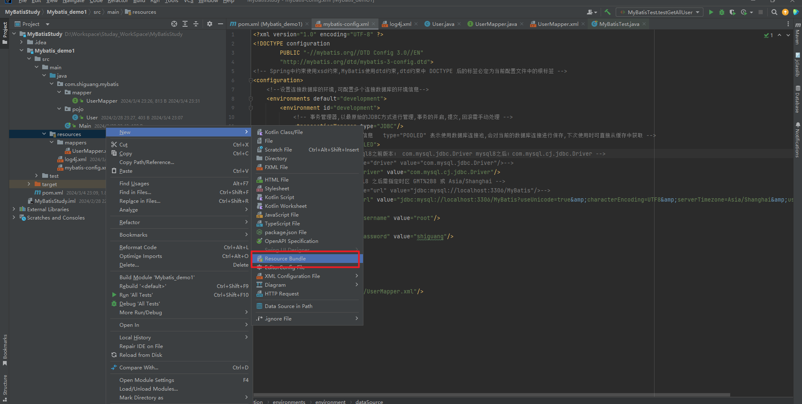


由于可能存在多个配置文件，为了避免配置文件key 重复，可以统一为每个配置文件添加个前缀以作区分

比如以文件名作为前缀 

```properties
jdbc.driver=com.mysql.cj.jdbc.Driver
jdbc.url=jdbc:mysql://localhost:3306/MyBatis?useUnicode=true&characterEncoding=UTF8&serverTimezone=Asia/Shanghai&useSSL=false
jdbc.username=root
jdbc.password=shiguang
```

通过 `<properties resource="jdbc.properties"></properties>` 引入配置文件

引入配置文件后，可以通过 `${属性名}` 的方式访问属性

```properties
<!-- 驱动名称  mysql8之前版本： com.mysql.jdbc.Driver mysql8之后：com.mysql.cj.jdbc.Driver -->
<!--                <property name="driver" value="com.mysql.jdbc.Driver"/>-->
<!--                <property name="driver" value="com.mysql.cj.jdbc.Driver"/>-->
<property name="driver" value="${jdbc.driver}"/>
<!-- 连接地址 mysql8 之后需指定时区 GMT%2B8 或 Asia/Shanghai -->
<!--                <property name="url" value="jdbc:mysql://localhost:3306/MyBatis"/>-->
<!--                <property name="url" value="jdbc:mysql://localhost:3306/MyBatis?useUnicode=true&amp;characterEncoding=UTF8&amp;serverTimezone=Asia/Shanghai&amp;useSSL=false"/>-->
<property name="url" value="${jdbc.url}"/>
<!-- 用户名 -->
<!--                <property name="username" value="root"/>-->
<property name="username" value="${jdbc.username}"/>
<!-- 登录密码 -->
<!--                <property name="password" value="shiguang"/>-->
<property name="password" value="${jdbc.password}"/>
```

## typeAliases设置类型别名

1. `typeAlias`：设置某个具体的类型的别名
           属性：
           type：需要设置别名的类型的全类名
           alias：设置此类型的别名，若不设置此属性，该类型拥有默认的别名，即类名且不区分大小写
           若设置此属性，此时该类型的别名只能使用alias所设置的值
2. `package`:

​			 以包为单位，设置改包下所有的类型都拥有默认的别名，即类名且不区分大小写-

```properties
    <typeAliases>
        <!--<typeAlias type="com.atguigu.mybatis.bean.User"></typeAlias>-->
        <!--<typeAlias type="com.atguigu.mybatis.bean.User" alias="abc">
        </typeAlias>-->
       
        <package name="com.atguigu.mybatis.bean"/>
    </typeAliases>
```


## mappers引入映射文件

1. 逐个引入：

​	`<mapper resource="xxxMapper.xml"/>`

2. 以包为单位引入映射文件:

   要求：

   1. mapper接口所在的包要和映射文件所在的包一致
   2. mapper接口要和映射文件的名称一致

​	`<package name="xxx.xxx.xxx.mapper"/>`

> 层级创建包时不能用点比如 xxx.xxx.mapper而应以目录的形式创建比如 xxx/xxx/mapper

```properties
 <mappers>
        <mapper resource="UserMapper.xml"/>
        <!--
        以包为单位，将包下所有的映射文件引入核心配置文件
        注意：此方式必须保证mapper接口和mapper映射文件必须在相同的包下
        -->
        <package name="com.atguigu.mybatis.mapper"/>
   </mappers>
```


# MyBatis获取参数的两种方式（重点）

MyBatis获取参数值的两种方式：**${}**和**#{}** 

${}的本质就是字符串拼接，#{}的本质就是占位符赋值 

${}使用字符串拼接的方式拼接sql，若为字符串类型或日期类型的字段进行赋值时，需要手动加单引 号；

但是#{}使用占位符赋值的方式拼接sql，此时为字符串类型或日期类型的字段进行赋值时，可以自 动添加单引号


## 单个字面量类型的参数  

若mapper接口中的方法参数为单个的字面量类型 

此时可以使用`${}`和`#{}`以任意的名称获取参数的值，注意${}需要手动加单引号 

`ParameterMapper.java`

```java
/**
* 根据用户名查询用户信息
*/
User getUserByUsername(String username);
```

`ParameterMapper.xml`

```xml
 <!--User getUserByUsername(String username);-->
<select id="getUserByUsername" resultType="User">
<!--select * from t_user where username = '${username}'-->
    select * from t_user where username = #{username}
</select>
```

## 多个字面量类型的参数  

若mapper接口中的方法参数为多个时 此时MyBatis会自动将这些参数放在一个map集合中，

以`arg0`,`arg1`,...为键，以参数为值；以 `param1`,`param2`,...为键，以参数为值；

因此只需要通过`${}`和`#{}`访问map集合的键就可以获取相对应的 值，注意`${}`需要手动加单引号 

`ParameterMapper.java`

```java
/**
* 验证登录
*/
User checkLogin(String username, String password);
```

`ParameterMapper.xml`

```xml
<!--User checkLogin(String username, String password);-->
<select id="checkLogin" resultType="User">
    <!--select * from t_user where username = #{arg0} and password = #{arg1}-->
    select * from t_user where username = '${param1}' and password = '${param2}'
</select>
```

## map集合类型的参数  

若mapper接口中的方法需要的参数为多个时，此时可以手动创建map集合，

将这些数据放在map中 只需要通过`${}`和`#{}`访问map集合的键就可以获取相对应的值，注意${}需要手动加单引号 

`ParameterMapper.java`

```java
/**
* 验证登录（参数为map）
*/
User checkLoginByMap(Map<String, Object> map);
```

`ParameterMapper.xml`

```xml
<!--User checkLoginByMap(Map<String, Object> map);-->
<select id="checkLoginByMap" resultType="User">
    select * from t_user where username = #{username} and password = #{password}
</select>
```

`ParameterMapperTest.java`

```java
@Test
    public void testCheckLoginByMap(){
        SqlSession sqlSession = SqlSessionUtils.getSqlSession();
        ParameterMapper mapper = sqlSession.getMapper(ParameterMapper.class);
        Map<String, Object> map = new HashMap<>();
        map.put("username", "admin");
        map.put("password", "123456");
        User user = mapper.checkLoginByMap(map);
        System.out.println(user);
    }
```

## 实体类类型的参数 (常用)

若mapper接口中的方法参数为实体类对象时 此时可以使用`${}`和`#{}`，

通过访问实体类对象中的属性名(有相应的get,set方法)获取属性值，注意`${}`需要手动加单引号 

`ParameterMapper.java`

```java
/**
* 添加用户信息
*/
int insertUser(User user);
```

`ParameterMapper.xml`

```xml
<!--int insertUser(User user);-->
<insert id="insertUser">
    insert into t_user values(null,#{username},#{password},#{age},#{sex},#{email})
</insert>
```

`ParameterMapperTest.java`

```java
@Test
public void testInsertUser(){
    SqlSession sqlSession = SqlSessionUtils.getSqlSession();
    ParameterMapper mapper = sqlSession.getMapper(ParameterMapper.class);
    int result = mapper.insertUser(new User(null, "李四", "123", 23, "男", "123@qq.com"));
    System.out.println(result);
}
```


## 使用@Param标识参数 

可以通过`@Param`注解标识mapper接口中的方法参数  此时，会将这些参数放在map集合中，

以`@Param`注解的value属性值为键，以参数为值；以 param1,param2...为键，以参数为值；

只需要通过`${}`和`#{}`访问map集合的键就可以获取相对应的值， 注意`${}`需要手动加单引号

`ParameterMapper.java`

```java
/**
* 验证登录（使用@Param）
*/
User checkLoginByParam(@Param("username") String username, @Param("password") String password);
```

`ParameterMapper.xml`

```xml
<!--User checkLoginByParam(@Param("username") String username, @Param("password") String password);-->
<select id="checkLoginByParam" resultType="User">
    select * from t_user where username = #{username} and password = #{password}
</select>
```

`ParameterMapperTest.java`

```java
@Test
public void testCheckLoginByParam(){
    SqlSession sqlSession = SqlSessionUtils.getSqlSession();
    ParameterMapper mapper = sqlSession.getMapper(ParameterMapper.class);
    User user = mapper.checkLoginByParam("admin", "123456");
    System.out.println(user);
}
```


可以将这5种情况分为两种情况：

1. 实体类对象
2. 其余的情况全部用`@Param`注解

# MyBatis的各种查询功能

## 查询一个实体类对象

`SelectMapper.java`

```java
/**
* 根据id查询用户信息
*/
List<User> getUserById(@Param("id") Integer id);
```

`SelectMapper.xml`

```xml
<!--User getUserById(@Param("id") Integer id);-->
<select id="getUserById" resultType="User">
    select * from t_user where id = #{id}
</select>
```

## 查询一个List集合

`SelectMapper.java`

```java
/**
* 查询所有的用户信息
*/
List<User> getAllUser();
```

`SelectMapper.xml`

```xml
<!--List<User> getAllUser();-->
<select id="getAllUser" resultType="User">
    select * from t_user
</select>
```

## 查询单个数据

`SelectMapper.java`

```java
/**
* 查询用户信息的总记录数
*/
Integer getCount();
```

`SelectMapper.xml`

```xml
<!--Integer getCount();-->
<select id="getCount" resultType="_int">
    select count(*) from t_user
</select>
```

## 查询一条数据为map集合

`SelectMapper.java`

```java
 /**
 * 根据id查询用户信息为一个map集合
 */
Map<String, Object> getUserByIdToMap(@Param("id") Integer id);
```

`SelectMapper.xml`

```xml
<!--Map<String, Object> getAllUserToMap();-->
<select id="getAllUserToMap" resultType="map">
    select * from t_user
</select>
```

## 查询多条数据为map集合

### 方式一

`SelectMapper.java`

```java
/**
* 查询所有用户信息为map集合
 * 将表中的数据以map集合的方式查询，一条数据对应一个map;
* 若有多条数据，就会产生多个map集合，此时可以将这些map放在一个1ist集合中获取
*/
List<Map<String, Object>> getAllUserToListMap();
```

`SelectMapper.xml`

```xml
<!--List<Map<String, Object>> getAllUserToListMap();-->
<select id="getAllUserToListMap" resultType="user">
    select * from t_user
</select>
```

### 方式二

`SelectMapper.java`

```java
/**
* 查询所有用户信息为map集合
* 将表中的数据以map集合的方式查询，一条数据对应一个map:
* 若有多条数据，就会产生多个map集合，并且最终要以一个map的方式返回数据，
* 此时需要通过@MapKey注解设置map集合的键，值是每条数据所对应的map集合
*/
@MapKey("id")
Map<String, Object> getAllUserToMap();
```

`SelectMapper.xml`

```xml
<!--Map<String, Object> getAllUserToMap();-->
<select id="getAllUserToMap" resultType="map">
    select * from t_user
</select>
```

# 特殊SQL的执行

## 模糊查询

`SQLMapper.java`

```java
/**
* 根据用户名模糊查询用户信息
*/
List<User> getUserByLike(@Param("username") String username);
```

`SQLMapper.xml`

```xml
<!--List<User> getUserByLike(@Param("username") String username);-->
<select id="getUserByLike" resultType="User">
    <!--select * from t_user where username like '%${username}%'-->
    <!--select * from t_user where username like concat('%',#{username},'%')-->
    select * from t_user where username like "%"#{username}"%"
</select>
```

## 批量删除

`SQLMapper.java`

```java
/**
* 批量删除
*/
int deleteMore(@Param("ids") String ids);
```

`SQLMapper.xml`

```java
<!--int deleteMore(@Param("ids") String ids);-->
<delete id="deleteMore">
    delete from t_user where id in (${ids})
</delete>
```

## 动态设置表名

`SQLMapper.java`

```java
/**
* 查询指定表中的数据
*/
List<User> getUserByTableName(@Param("tableName") String tableName);
```

`SQLMapper.xml`

```xml
<!--List<User> getUserByTableName(@Param("tableName") String tableName);-->
<select id="getUserByTableName" resultType="User">
    select * from ${tableName}
</select>
```

## 添加功能获取自增的主键

t_clazz(clazz_id,clazz_name)
t_student(student_id,student_name,clazz_id)
1、添加班级信息
2、获取新添加的班级的id
3、为班级分配学生，即将某学的班级id修改为新添加的班级的id

`SQLMapper.java`

```java
/**
* 添加用户信息
*/
void insertUser(User user);
```

`SQLMapper.xml`

```xml
<!--
        void insertUser(User user);
        useGeneratedKeys:设置当前标签中的sql使用了自增的主键
        keyProperty:将自增的主键的值赋值给传输到映射文件中参数的某个属性
    -->
<insert id="insertUser" useGeneratedKeys="true" keyProperty="id">
    insert into t_user values(null,#{username},#{password},#{age},#{sex},#{email})
</insert>
```

# 自定义映射resultMap

## resultMap处理字段和属性的映射关系

若字段名和实体类中的属性名不一致，则可以通过`resultMap`设置自定义映射

`EmpMapper.java`

```java
/**
* 查询所有的员工信息
*/
List<Emp> getAllEmp();
```

`EmpMapper.xml`

```xml
<!--
        resultMap：设置自定义映射关系
        id：唯一标识，不能重复
        type：设置映射关系中的实体类类型
        子标签：
        id：设置主键的映射关系
        result：设置普通字段的映射关系
        属性：
        property：设置映射关系中的属性名，必须是type属性所设置的实体类类型中的属性名
        column：设置映射关系中的字段名，必须是sql语句查询出的字段名
    -->
<resultMap id="empResultMap" type="Emp">
    <id property="eid" column="eid"></id>
    <result property="empName" column="emp_name"></result>
    <result property="age" column="age"></result>
    <result property="sex" column="sex"></result>
    <result property="email" column="email"></result>
</resultMap>

<!--List<Emp> getAllEmp();-->
<select id="getAllEmp" resultMap="empResultMap">
    select * from t_emp
</select>
```

> 若字段名和实体类中的属性名不一致，但是字段名符合数据库的规侧（使用），实体类中的属性
> 名符合java的规则（使用驼峰）
> 此时也可通过以下两种方式处理字段名和实体类中的属性的映射关系
>
> 1. 可以通过为字段起别名的方式，保证和实体类中的属性名保特一致
> 2. 可以在MyBatis的核心配置文件中设置一个全局配置信息`mapUnderscoreToCamelCase`,可
>    以在查询表中数据时，自动将类型的字段名转换为驼峰
>    例如：字段名user_name,设置了`mapUnderscoreToCamelCase`,此时字段名就会转换为
>    userName

## 多对一映射处理

### 环境准备

```sql
CREATE TABLE `t_emp` (
  `eid` int NOT NULL AUTO_INCREMENT,
  `emp_name` varchar(20) COLLATE utf8mb4_general_ci DEFAULT NULL,
  `age` int NOT NULL,
  `sex` char(1) COLLATE utf8mb4_general_ci DEFAULT NULL,
  `email` varchar(20) COLLATE utf8mb4_general_ci DEFAULT NULL,
  `did` int DEFAULT NULL,
  PRIMARY KEY (`eid`)
) ENGINE=InnoDB AUTO_INCREMENT=5 DEFAULT CHARSET=utf8mb4 COLLATE=utf8mb4_general_ci


CREATE TABLE `t_dept` (
  `did` int NOT NULL AUTO_INCREMENT,
  `dept_name` varchar(20) COLLATE utf8mb4_general_ci DEFAULT NULL,
  PRIMARY KEY (`did`)
) ENGINE=InnoDB DEFAULT CHARSET=utf8mb4 COLLATE=utf8mb4_general_ci
```


> 查询员工信息以及员工所对应的部门信息

`EmpMapper.java`

```java
/**
* 查询员工以及员工所对应的部门信息
*/
Emp getEmpAndDept(@Param("eid") Integer eid);
```

### 级联方式处理映射关系

```xml
<!--处理多对一映射关系方式一：级联属性赋值-->
<resultMap id="empAndDeptResultMapOne" type="Emp">
    <id property="eid" column="eid"></id>
    <result property="empName" column="emp_name"></result>
    <result property="age" column="age"></result>
    <result property="sex" column="sex"></result>
    <result property="email" column="email"></result>
    <result property="dept.did" column="did"></result>
    <result property="dept.deptName" column="dept_name"></result>
</resultMap>

<!--Emp getEmpAndDept(@Param("eid") Integer eid);-->
<select id="getEmpAndDept" resultMap="empAndDeptResultMapOne">
    select * from t_emp left join t_dept on t_emp.did = t_dept .did where t_emp.eid = #{eid}
</select>
```

### 使用association处理映射关系

```xml
<resultMap id="empAndDeptResultMapTwo" type="Emp">
    <id property="eid" column="eid"></id>
    <result property="empName" column="emp_name"></result>
    <result property="age" column="age"></result>
    <result property="sex" column="sex"></result>
    <result property="email" column="email"></result>
    <!--
            association:处理多对一的映射关系
            property:需要处理多对的映射关系的属性名
            javaType:该属性的类型
        -->
    <association property="dept" javaType="Dept">
        <id property="did" column="did"></id>
        <result property="deptName" column="dept_name"></result>
    </association>
</resultMap>

<!--Emp getEmpAndDept(@Param("eid") Integer eid);-->
<select id="getEmpAndDept" resultMap="empAndDeptResultMapTwo">
    select * from t_emp left join t_dept on t_emp.did = t_dept .did where t_emp.eid = #{eid}
</select>
```

### 分步查询

#### 第一步：查询员工信息

`EmpMapper.java`

```java
/**
* 通过分步查询查询员工以及员工所对应的部门信息
* 分步查询第一步：查询员工信息
*/
Emp getEmpAndDeptByStepOne(@Param("eid") Integer eid);
```

`EmpMapper.xml`

```xml
<resultMap id="empAndDeptByStepResultMap" type="Emp">
    <id property="eid" column="eid"></id>
    <result property="empName" column="emp_name"></result>
    <result property="age" column="age"></result>
    <result property="sex" column="sex"></result>
    <result property="email" column="email"></result>
    <!--
            select:设置分步查询的sql的唯一标识（namespace.SQLId或mapper接口的全类名.方法名）
            column:设置分布查询的条件
            fetchType:当开启了全局的延迟加载之后，可通过此属性手动控制延迟加载的效果
            fetchType="lazy|eager":lazy表示延迟加载，eager表示立即加载
        -->
    <association property="dept"
                 select="com.atguigu.mybatis.mapper.DeptMapper.getEmpAndDeptByStepTwo"
                 column="did"
                 fetchType="eager"></association>
</resultMap>

<!--Emp getEmpAndDeptByStepOne(@Param("eid") Integer eid);-->
<select id="getEmpAndDeptByStepOne" resultMap="empAndDeptByStepResultMap">
    select * from t_emp where eid = #{eid}
</select>
```

#### 第二步：根据员工所对应的部门d查询部门信息

`DeptMapper.java`

```java
/**
* 通过分步查询查询员工以及员工所对应的部门信息
* 分步查询第二步：通过did查询员工所对应的部门
*/
Dept getEmpAndDeptByStepTwo(@Param("did") Integer did);
```

`DeptMapper.xml`

```xml
<!--Dept getEmpAndDeptByStepTwo(@Param("did") Integer did);-->
<select id="getEmpAndDeptByStepTwo" resultType="Dept">
    select * from t_dept where did = #{did}
</select>
```

## 一对多映射处理

### collection

`DeptMapper.java`

```java
/**
 * 获取部门以及部门中所有的员工信息
*/
Dept getDeptAndEmp(@Param("did") Integer did);
```
`DeptMapper.xml`

```xml
<resultMap id="deptAndEmpResultMap" type="Dept">
    <id property="did" column="did"></id>
    <result property="deptName" column="dept_name"></result>
    <!--
            collection：处理一对多的映射关系
            ofType：表示该属性所对应的集合中存储数据的类型
        -->
    <collection property="emps" ofType="Emp">
        <id property="eid" column="eid"></id>
        <result property="empName" column="emp_name"></result>
        <result property="age" column="age"></result>
        <result property="sex" column="sex"></result>
        <result property="email" column="email"></result>
    </collection>
</resultMap>


<!--Dept getDeptAndEmp(@Param("did") Integer did);-->
<select id="getDeptAndEmp" resultMap="deptAndEmpResultMap">
    select * from t_dept left join t_emp on t_dept.did = t_emp.did where t_dept.did = #{did}
</select>
```

### 分步查询

#### 第一步：查询部门信息

`DeptMapper.java`

```java
/**
* 通过分步查询查询部门以及部门中所有的员工信息
* 分步查询第一步：查询部门信息
*/
Dept getDeptAndEmpByStepOne(@Param("did") Integer did);
```

`DeptMapper.xml`

```xml
<resultMap id="deptAndEmpByStepResultMap" type="Dept">
    <id property="did" column="did"></id>
    <result property="deptName" column="dept_name"></result>
    <collection property="emps"
                select="com.atguigu.mybatis.mapper.EmpMapper.getDeptAndEmpByStepTwo"
                column="did" fetchType="eager"></collection>
</resultMap>

<!--Dept getDeptAndEmpByStepOne(@Param("did") Integer did);-->
<select id="getDeptAndEmpByStepOne" resultMap="deptAndEmpByStepResultMap">
    select * from t_dept where did = #{did}
</select>
```

#### 第二步：根据部门id查询部门中的所有员工

`EmpMapper.java`

```java
/**
     * 通过分步查询查询部门以及部门中所有的员工信息
     * 分步查询第二步：根据did查询员工信息
     */
List<Emp> getDeptAndEmpByStepTwo(@Param("did") Integer did);
```

`EmpMapper.xml`

```xml
<!--List<Emp> getDeptAndEmpByStepTwo(@Param("did") Integer did);-->
<select id="getDeptAndEmpByStepTwo" resultType="Emp">
    select * from t_emp where did = #{did}
</select>
```

分步查询的优点：可以实现延迟加载，但是必须在核心配置文件中设置全局配置信息：
`lazyLoadingEnabled`:延迟加载的全局开关。当开启时，所有关联对象都会延迟加载
`aggressiveLazyLoading`：当开启时，任何方法的调用都会加载该对象的所有属性。否则，每个
属性会按需加载
此时就可以实现按需加载，获取的数据是什么，就只会执行相应的sql。此时可通过`association`和
`collection`中的`fetchType`属性设置当前的分步查询是否使用延迟加载，`fetchType`="`lazy`(延迟加
载)川`eager`(立即加载)"

> 在 MyBatis 以及其他 ORM（对象关系映射）框架中，N+1 查询问题是一种可能导致性能下降的情况。
>
> **一、问题描述**
>
> 假设有两个实体类，A 和 B，它们之间存在一对多的关系。例如，一个 A 对象可能关联多个 B 对象。当我们查询 A 对象列表时，如果没有进行优化处理，就可能出现 N+1 查询问题。
>
> 首先，查询 A 对象列表会执行一条 SQL 语句，假设查询出了 N 个 A 对象。接下来，当我们遍历这个 A 对象列表，并且需要获取每个 A 对象关联的 B 对象时，对于每一个 A 对象，都会执行一条额外的 SQL 查询去获取其关联的 B 对象。这样总共就执行了 N + 1 条 SQL 查询，其中 1 是最初查询 A 对象列表的那条 SQL，N 是为每个 A 对象查询其关联 B 对象的 SQL 数量。
>
> **二、示例场景**
>
> 比如有一个订单表（对应实体类 A）和订单详情表（对应实体类 B）。查询所有订单时执行了一条 SQL 语句获取订单列表。但当我们要查看每个订单的详细信息（订单详情表中的数据）时，如果没有优化，就会为每个订单都执行一条查询订单详情的 SQL 语句，导致出现 N+1 查询问题。
>
> **三、带来的影响**
>
> 1. 性能下降：执行大量的 SQL 查询会增加数据库的负担，降低系统的响应速度，特别是当数据量较大时，性能问题会更加明显。
> 2. 资源消耗：会消耗更多的网络资源、数据库连接资源等，可能导致系统资源紧张。
>
> **四、解决方法**
>
> 1. 关联查询：在查询 A 对象列表的同时，使用关联查询一次性获取 A 对象及其关联的 B 对象。这样只需要执行一条复杂一点的 SQL 语句，就可以避免 N+1 查询问题。
> 2. 延迟加载：可以配置 MyBatis 的延迟加载功能，当真正需要访问 B 对象时才去执行查询 B 对象的 SQL 语句，避免在查询 A 对象列表时就加载所有关联的 B 对象，从而减少不必要的查询。但需要注意合理使用延迟加载，避免在循环中多次触发延迟加载导致性能问题。


# 动态SQL

Mybatis框架的动态SQL技术是一种根据特定条件动态拼装SQL语句的功能，它存在的意义是为了解决
拼接SQL语句字符串时的痛点问题。

## if

> if标签可通过`test`属性的表达式进行判断，若表达式的结果为true,则标签中的内容会执行；反之标签中
> 的内容不会执行

`DynamicSQLMapper.java`

```java
/**
* 多条件查询
*/
List<Emp> getEmpByCondition(Emp emp);
```

`DynamicSQLMapper.xml`

```xml
<!--List<Emp> getEmpByCondition(Emp emp);-->
<select id="getEmpByCondition" resultType="Emp">
    select * from t_emp where 1=1
    <if test="empName != null and empName != ''">
        emp_name = #{empName}
    </if>
    <if test="age != null and age != ''">
        and age = #{age}
    </if>
    <if test="sex != null and sex != ''">
        and sex = #{sex}
    </if>
    <if test="email != null and email != ''">
        and email = #{email}
    </if>
</select>
```

## where

> `where`和`if`一般结合使用：
>
> 1. 若`where`标签中的`if`条件都不满足，则`where`标签没有任何功能，即不会添加`where`关键字
>
> 2. 若`where`标签中的`if`条件满足，则`where`标签会自动添加`where`关键字，并将条件**最前方**多余的`and`去掉
>
>    **注意：where标签不能去掉条件最后多余的`and`**

```xml
<select id="getEmpByConditionTwo" resultType="Emp">
    select * from t_emp
    <where>
        <if test="empName != null and empName != ''">
            emp_name = #{empName}
        </if>
        <if test="age != null and age != ''">
            and age = #{age}
        </if>
        <if test="sex != null and sex != ''">
            or sex = #{sex}
        </if>
        <if test="email != null and email != ''">
            and email = #{email}
        </if>
    </where>
</select>
```

## trim

> `trim`用于去掉或添加标签中的内容
> 常用属性：
> `prefix`:在`trim`标签中的内容的前面添加某些内容
> `prefixOverrides`:在`trim`标签中的内容的前面去掉某些内容
> `suffix`:在`trim`标签中的内容的后面添加某些内容
> `suffixOverrides`:在`trim`标签中的内容的后面去掉某些内容

```xml
<!--List<Emp> getEmpByCondition(Emp emp);-->
<select id="getEmpByCondition" resultType="Emp">
    select <include refid="empColumns"></include> from t_emp
    <trim prefix="where" suffixOverrides="and|or">
        <if test="empName != null and empName != ''">
            emp_name = #{empName} and
        </if>
        <if test="age != null and age != ''">
            age = #{age} or
        </if>
        <if test="sex != null and sex != ''">
            sex = #{sex} and
        </if>
        <if test="email != null and email != ''">
            email = #{email}
        </if>
    </trim>
</select>
```

## choose、when、otherwise

> choose、when、otherwise相当于 if()...else if()...else{}
>
> when至少要有一个，otherwise最多有一个

`DynamicSQLMapper.java`

```java
/**
* 测试choose、when、otherwise
*/
List<Emp> getEmpByChoose(Emp emp);
```

`DynamicSQLMapper.xml`

```xml
<!--List<Emp> getEmpByChoose(Emp emp);-->
<select id="getEmpByChoose" resultType="Emp">
    select * from t_emp
    <where>
        <choose>
            <when test="empName != null and empName != ''">
                emp_name = #{empName}
            </when>
            <when test="age != null and age != ''">
                age = #{age}
            </when>
            <when test="sex != null and sex != ''">
                sex = #{sex}
            </when>
            <when test="email != null and email != ''">
                email = #{email}
            </when>
            <otherwise>
                did = 1
            </otherwise>
        </choose>
    </where>
</select>
```

## foreach

> 属性：
> `collection`:设置要循环的数组或集合
> `tem`：表示集合或数组中的每一个数据
> `separator`:设置循环体之间的分隔符
> `open`:设置foreach:标签中的内容的开始符
> `close`:设置foreach:标签中的内容的结束符

### 批量删除

`DynamicSQLMapper.java`

```java
/**
* 通过数组实现批量删除
*/
int deleteMoreByArray(@Param("eids") Integer[] eids);
```

`DynamicSQLMapper.xml`

```xml
<!--int deleteMoreByArray(@Param("eids") Integer[] eids);-->
<delete id="deleteMoreByArray">
    delete from t_emp where
    <foreach collection="eids" item="eid" separator="or">
        eid = #{eid}
    </foreach>
    <!--
            delete from t_emp where eid in
            <foreach collection="eids" item="eid" separator="," open="(" close=")">
                #{eid}
            </foreach>
        -->
</delete>
```

### 批量添加

`DynamicSQLMapper.java`

```java
/**
* 通过list集合实现批量添加
*/
int insertMoreByList(@Param("emps") List<Emp> emps);
```

`DynamicSQLMapper.xml`

```xml
<!--int insertMoreByList(@Param("emps") List<Emp> emps);-->
<insert id="insertMoreByList">
    insert into t_emp values
    <foreach collection="emps" item="emp" separator=",">
        (null,#{emp.empName},#{emp.age},#{emp.sex},#{emp.email},null)
    </foreach>
</insert>
```

## SQL片段

> sql片段，可以记录一段公共sql片段，在使用的地方通过include标签进行引入

```java
<sql id="empColumns">eid,emp_name,age,sex,email</sql>

<!--List<Emp> getEmpByCondition(Emp emp);-->
<select id="getEmpByCondition" resultType="Emp">
    select <include refid="empColumns"></include> from t_emp
    <trim prefix="where" suffixOverrides="and|or">
        <if test="empName != null and empName != ''">
            emp_name = #{empName} and
        </if>
        <if test="age != null and age != ''">
            age = #{age} or
        </if>
        <if test="sex != null and sex != ''">
            sex = #{sex} and
        </if>
        <if test="email != null and email != ''">
            email = #{email}
        </if>
    </trim>
</select>
```


# MyBatis的缓存

## 一级缓存

一级缓存是`SqlSession`级别的，通过同一个`SqlSession`查询的数据会被缓存，下次查询相同的数据，就
会从缓存中直接获取，不会从数据库重新访问

### 使一级缓存失效的四种情况

1. 不同的`SqlSession`对应不同的一级缓存
2. 同一个`SqlSession`但是查询条件不同
3. 同一个`SqlSession`两次查询期间执行了任何一次增删改操作
4. 同一个`SqlSession`两次查询期间手动清空了缓存(sqlSession.`clearCache()`)


## 二级缓存

二级缓存是`SqlSessionFactory`级别，通过同一个`SqlSessionFactoryt`创建的`SqlSession`查询的结果会被
缓存；此后若再次执行相同的查询语句，结果就会从缓存中获取

### **二级缓存开启的条件**

1. 在核心配置文件中，设置全局配置属性`cacheEnabled`="true",默认为true,不需要设置
2. 在映射文件中设置标签 `<cache/>`
3. 二级缓存必须在`SqlSession`关闭或提交之后有效
4. 查询的数据所转换的实体类类型必须实现序列化的接口

### **使二级缓存失效的情况**

两次查询之间执行了任意的增删改，会使一级和二级缓存同时失效

### 二级缓存的相关配置

在mapper配置文件中添加的`<cache/>`标签可以设置一些属性：
1、`eviction`属性：缓存回收策略
`LRU`(Least Recently Used)：最近最少使用的，移除最长时间不被使用的对象。
`FIFO`(First in First out)：先进先出，按对象进入缓存的顺序来移除它们。
`SOFT`（软引用）：移除基于垃圾回收器状态和软引用规则的对象。
`WEAK`（弱引用）：更积极地移除基于垃圾收集器状态和弱引用规则的对象。
默认的是`LRU`。

2、`flushinterval`属性：刷新间隔，单位毫秒
默认情况是不设置，也就是没有刷新间隔，缓存仅仅调用DML(增删改)语句时刷新

3、`size`属性：引用数目，正整数
代表缓存最多可以存储多少个对象，太大容易导致内存益出
4、`readOnly`属性：只读，true/false
tue：只读缓存，会给所有调用者返回缓存对象的相同实例。因此这些对象不能被修改。这提供了
很重要的性能优势。
flse：读写缓存，会返回缓存对象的拷贝（通过序列化）。这会慢一些，但是安全，因此默认是
false。

## MyBatis缓存查询的顺序


1. 先查询二级缓存，因为二级缓存中可能会有其他程序已经查出来的数据，可以拿来直接使用。
2. 如果二级缓存没有命中，再查询一级缓存
3. 如果一级缓存也没有命中，则查询数据库
4. SqlSession关闭之后，一级缓存中的数据会写入二级缓存

## 整合第三方缓存EHCache

> EHCache只能替换二级缓存，不能替换一级缓存

### 添加依赖

```xml
<!-- Mybatis EHCache整合包 -->
<dependency>
    <groupId>org.mybatis.caches</groupId>
    <artifactId>mybatis-ehcache</artifactId>
    <version>1.2.1</version>
</dependency>
<!-- slf4j日志门面的一个具体实现 -->
<dependency>
    <groupId>ch.qos.logback</groupId>
    <artifactId>logback-classic</artifactId>
    <version>1.2.3</version>
</dependency>
```

### 各jar包功能

| jar包名称       | 作用                           |
| --------------- | ------------------------------ |
| mybatis-ehcache | Mybatis和EHCache的整合包       |
| ehcache         | EHCache核心包                  |
| slf4j-api       | SLF4J日志门面包                |
| logback-classic | 支持SLF4门面接口的一个具体实现 |

### 创建EHCache的配置文件`ehcache.xml`

> 配置文件名称固定，只能叫做`ehcache.xml`

```xml
<?xml version="1.0" encoding="utf-8" ?>
<ehcache xmlns:xsi="http://www.w3.org/2001/XMLSchema-instance"
         xsi:noNamespaceSchemaLocation="../config/ehcache.xsd">
    <!-- 磁盘保存路径 -->
    <diskStore path="D:\atguigu\ehcache"/>

    <defaultCache
            maxElementsInMemory="1000"
            maxElementsOnDisk="10000000"
            eternal="false"
            overflowToDisk="true"
            timeToIdleSeconds="120"
            timeToLiveSeconds="120"
            diskExpiryThreadIntervalSeconds="120"
            memoryStoreEvictionPolicy="LRU">
    </defaultCache>
</ehcache>
```

### 设置二级缓存的类型

> 在mapper xml 中进行配置

```xml
<cache type="org.mybatis.caches.ehcache.EhcacheCache" />
```

### 加入logback日志

> 存在SLF4J时，作为简易日志的log4j将失效，比时我们需要借助SLF4J的具体实现logback来打印日志。

创建logback的配置文件`logback.xml`

```xml
<?xml version="1.0" encoding="UTF-8"?>
<configuration debug="true">
    <!-- 指定日志输出的位置 -->
    <appender name="STDOUT"
              class="ch.qos.logback.core.ConsoleAppender">
        <encoder>
            <!-- 日志输出的格式 -->
            <!-- 按照顺序分别是：时间、日志级别、线程名称、打印日志的类、日志主体内容、换行 -->
            <pattern>[%d{HH:mm:ss.SSS}] [%-5level] [%thread] [%logger] [%msg]%n</pattern>
        </encoder>
    </appender>

    <!-- 设置全局日志级别。日志级别按顺序分别是：DEBUG、INFO、WARN、ERROR -->
    <!-- 指定任何一个日志级别都只打印当前级别和后面级别的日志。 -->
    <root level="DEBUG">
        <!-- 指定打印日志的appender，这里通过“STDOUT”引用了前面配置的appender -->
        <appender-ref ref="STDOUT" />
    </root>

    <!-- 根据特殊需求指定局部日志级别 -->
    <logger name="com.atguigu.crowd.mapper" level="DEBUG"/>

</configuration>
```

### EHCache配置文件说明

| 属性名                          | 作用                                                         | 是否必须 |
| ------------------------------- | ------------------------------------------------------------ | -------- |
| maxElementsInMemory             | 在内存中缓存的element的最大数目                              | 是       |
| maxElementsOnDisk               | 在磁盘上缓存的element的最大数目，若是0表示无穷大             | 是       |
| eternal                         | 设定缓存的elements是否永远不过期。如果为true,<br />则缓存的数据始终有效，如果为false那么还要根据<br />timeToldleSeconds、timeToLiveSeconds判断 | 是       |
| overflowToDisk                  | 设定当内存缓存益出的时候是否将过期的element<br/>缓存到磁盘上 | 是       |
| timeToldleSeconds               | 当缓存在EhCache中的数据前后两次访问的时间超过<br />timeToldleSeconds的属性取值时，这些数据便会删除，<br />默认值是0，也就是可闲置时间无穷大 | 否       |
| timeToLiveSeconds               | 缓存element的有效生命期，默认是0<br />也就是element存活时间无穷大 | 否       |
| diskSpoolBufferSizeMB           | DiskStore(磁盘缓存)的缓存区大小。默认是30MB。<br />每个Cache都应该有自己的一个缓冲区 | 否       |
| diskPersistent                  | 在VM重启的时候是否启用磁盘保存EhCache中的数据，<br />默认是false。 | 否       |
| diskExpiryThreadIntervalSeconds | 磁盘缓存的清理线程运行间隔，默认是120秒。<br />每个120s，相应的线程会进行一次EhCache中数据的清理工作 | 否       |
| memoryStoreEvictionPolicy       | 当内存缓存达到最大，有新的element加入的时<候，<br />移除缓存中element的策略。默认是LRU<br />(最近最少使用)可选的有FU(最不常使用)和FIFO(先进先出) | 否       |

# MyBatis的逆向工程

正向工程：先创建java实体类，由框架负责根据实体类生成数据库表。Hibernate支持正向工程
逆向工程：先创建数据库表，由框架负责根据数据库表，反向生成如下资源：

1. Java实体类
2. Mapper接口
3. Mapper映射文件

## 创建逆向工程的步骤

### 添加依赖和插件

> MBG(MyBatis Generator)

```xml
<?xml version="1.0" encoding="UTF-8"?>
<project xmlns="http://maven.apache.org/POM/4.0.0"
         xmlns:xsi="http://www.w3.org/2001/XMLSchema-instance"
         xsi:schemaLocation="http://maven.apache.org/POM/4.0.0 http://maven.apache.org/xsd/maven-4.0.0.xsd">
    <modelVersion>4.0.0</modelVersion>

    <groupId>com.shiguang.mybatis</groupId>
    <artifactId>MyBatis_MBG</artifactId>
    <version>1.0-SNAPSHOT</version>
    <packaging>jar</packaging>

    <!-- 依赖MyBatis核心包 -->
    <dependencies>
        <dependency>
            <groupId>org.mybatis</groupId>
            <artifactId>mybatis</artifactId>
            <version>3.5.7</version>
        </dependency>
        <!-- junit测试 -->
        <dependency>
            <groupId>junit</groupId>
            <artifactId>junit</artifactId>
            <version>4.12</version>
            <scope>test</scope>
        </dependency>

        <!-- MySQL驱动 -->
        <dependency>
            <groupId>mysql</groupId>
            <artifactId>mysql-connector-java</artifactId>
<!--            <version>5.1.3</version>-->
            <version>8.0.33</version>

        </dependency>

        <!-- log4j日志 -->
        <dependency>
            <groupId>log4j</groupId>
            <artifactId>log4j</artifactId>
            <version>1.2.17</version>
        </dependency>

        <!-- 分页插件 -->
        <dependency>
            <groupId>com.github.pagehelper</groupId>
            <artifactId>pagehelper</artifactId>
            <version>5.2.0</version>
        </dependency>
    </dependencies>

    <!-- 控制Maven在构建过程中相关配置 -->
    <build>

        <!-- 构建过程中用到的插件 -->
        <plugins>

            <!-- 具体插件，逆向工程的操作是以构建过程中插件形式出现的 -->
            <plugin>
                <groupId>org.mybatis.generator</groupId>
                <artifactId>mybatis-generator-maven-plugin</artifactId>
                <version>1.3.0</version>

                <!-- 插件的依赖 -->
                <dependencies>

                    <!-- 逆向工程的核心依赖 -->
                    <dependency>
                        <groupId>org.mybatis.generator</groupId>
                        <artifactId>mybatis-generator-core</artifactId>
                        <version>1.3.2</version>
                    </dependency>

                    <!-- 数据库连接池 -->
                    <dependency>
                        <groupId>com.mchange</groupId>
                        <artifactId>c3p0</artifactId>
                        <version>0.9.2</version>
                    </dependency>

                    <!-- MySQL驱动 -->
                    <dependency>
                        <groupId>mysql</groupId>
                        <artifactId>mysql-connector-java</artifactId>
<!--                        <version>5.1.8</version>-->
                        <version>8.0.33</version>
                    </dependency>
                </dependencies>
            </plugin>
        </plugins>
    </build>


</project>
```

### 数据库配置文件

`jdbc.properties`

```properties
jdbc.driver=com.mysql.cj.jdbc.Driver
jdbc.url=jdbc:mysql://localhost:3306/mybatis?useUnicode=true&characterEncoding=utf8
jdbc.username=root
jdbc.password=shiguang
```

### 创建MyBatis的核心配置文件

```xml
<?xml version="1.0" encoding="UTF-8" ?>
<!DOCTYPE configuration
        PUBLIC "-//mybatis.org//DTD Config 3.0//EN"
        "http://mybatis.org/dtd/mybatis-3-config.dtd">
<configuration>

    <properties resource="jdbc.properties"/>

    <typeAliases>
        <package name="com.shiguang.mybatis.pojo"/>
    </typeAliases>

    <plugins>
        <!--设置分页插件-->
        <plugin interceptor="com.github.pagehelper.PageInterceptor"/>
    </plugins>

    <environments default="development">
        <environment id="development">
            <transactionManager type="JDBC"/>
            <dataSource type="POOLED">
                <property name="driver" value="${jdbc.driver}"/>
                <property name="url" value="${jdbc.url}"/>
                <property name="username" value="${jdbc.username}"/>
                <property name="password" value="${jdbc.password}"/>
            </dataSource>
        </environment>
    </environments>

    <mappers>
        <package name="com.shiguang.mybatis.mapper"/>
    </mappers>
</configuration>
```

### 创建逆向工程的配置文件

> 文件名必须是：`generatorConfig.xml`

```xml
<?xml version="1.0" encoding="UTF-8"?>
<!DOCTYPE generatorConfiguration
        PUBLIC "-//mybatis.org//DTD MyBatis Generator Configuration 1.0//EN"
        "http://mybatis.org/dtd/mybatis-generator-config_1_0.dtd">
<generatorConfiguration>
    <!--
            targetRuntime: 执行生成的逆向工程的版本
                    MyBatis3Simple: 生成基本的CRUD（清新简洁版,只有增,删,改,查询所有,根据ID查询 5个方法）
                    MyBatis3: 生成带条件的CRUD（奢华尊享版）
     -->
    <context id="DB2Tables" targetRuntime="MyBatis3">
            <plugin type="org.mybatis.generator.plugins.ToStringPlugin">
                <!-- 可配置一些参数，如排除某些属性 -->
<!--                <property name="excludeFields" value="id"/>-->
            </plugin>


        <!-- 自定义注释 -->
        <commentGenerator>
            <!-- 禁用注释生成 -->
            <property name="suppressAllComments" value="true"/>
            <!-- 如果设置为true，则生成的注释中不会包含日期信息。默认值为false -->
            <property name="suppressDate" value="false"/>
            <!--如果设置为true，则会将数据库表和列的注释作为 Java 代码中的备注（remark）注释添加到生成的实体类中。默认值为false-->
            <property name="addRemarkComments" value="false"/>
        </commentGenerator>

        <!-- 数据库的连接信息 -->
        <jdbcConnection driverClass="com.mysql.cj.jdbc.Driver"
                        connectionURL="jdbc:mysql://localhost:3306/mybatis?useUnicode=true&amp;characterEncoding=utf8"
                        userId="root"
                        password="shiguang">
        </jdbcConnection>
        <!-- javaBean的生成策略(实体类)-->
        <javaModelGenerator targetPackage="com.shiguang.mybatis.pojo" targetProject=".\src\main\java">
            <!-- 是否能够使用子包,一个.代表一层目录 -->
            <property name="enableSubPackages" value="true" />
            <!-- 去除字符串前后空格,数据库字段名前后有空格时可以自动去除 -->
            <property name="trimStrings" value="true" />
            <!-- 设置是否生成有参构造方法 -->
            <property name="constructorBased" value="true"/>
            <!-- 设置是否生成无参构造方法 -->
            <property name="enableSubPackages" value="true"/>
            <property name="immutable" value="false"/>
            <!-- 设置是否生成 toString 方法 -->
            <property name="toStringGenerator" value="toStringBuilder"/>
        </javaModelGenerator>
        <!-- SQL映射文件的生成策略(xxxMapper.xml) -->
        <sqlMapGenerator targetPackage="com.shiguang.mybatis.mapper"  targetProject=".\src\main\resources">
            <!-- 是否能够使用子包,一个.代表一层目录 -->
            <property name="enableSubPackages" value="true" />
        </sqlMapGenerator>
        <!-- Mapper接口的生成策略(xxxMapper.java) -->
        <javaClientGenerator type="XMLMAPPER" targetPackage="com.shiguang.mybatis.mapper"  targetProject=".\src\main\java">
            <!-- 是否能够使用子包,一个.代表一层目录 -->
            <property name="enableSubPackages" value="true" />
        </javaClientGenerator>
        <!-- 逆向分析的表 -->
        <!-- tableName设置为*号，可以对应所有表，此时不写domainObjectName -->
        <!-- domainObjectName属性指定生成出来的实体类的类名 -->
<!--        <table tableName="t_emp" domainObjectName="Emp"/>-->
        <table tableName="t_dept" domainObjectName="Dept"/>
    </context>
</generatorConfiguration>
```

### 执行MBG插件的generate目标

> 执行前先将上次执行的文件全部删除

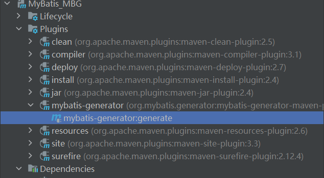

### 执行效果

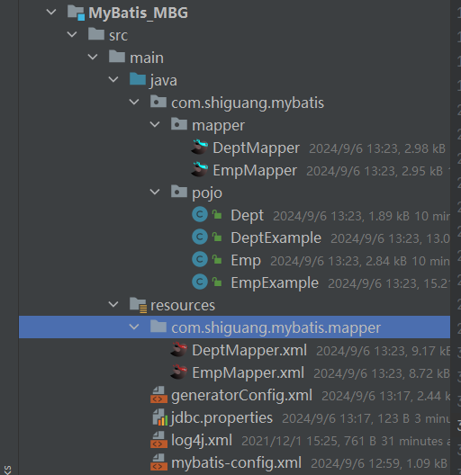


### 使用

```java
// 根据条件获取总记录数
int countByExample(DeptExample example);

// 根据条件删除
int deleteByExample(DeptExample example);

// 根据主键删除
int deleteByPrimaryKey(Integer did);

//  普通添加,值为null时会将null进行赋值
int insert(Dept record);

// 选择性添加,值为null时不赋值
int insertSelective(Dept record);

// 根据条件查询
List<Dept> selectByExample(DeptExample example);

// 根据主键查询
Dept selectByPrimaryKey(Integer did);

// 根据条件选择性修改,值为null时不进行赋值
int updateByExampleSelective(@Param("record") Dept record, @Param("example") DeptExample example);

// 根据条件修改,值为null时会进行赋值
int updateByExample(@Param("record") Dept record, @Param("example") DeptExample example);

// 根据主键选择性修改,值为null时不进行赋值
int updateByPrimaryKeySelective(Dept record);


// 根据主键修改,值为null时会进行赋值
int updateByPrimaryKey(Dept record);
```


### 测试

```java
@Test
public void testMBG(){
    try {
        InputStream is = Resources.getResourceAsStream("mybatis-config.xml");
        SqlSessionFactory sqlSessionFactory = new SqlSessionFactoryBuilder().build(is);
        SqlSession sqlSession = sqlSessionFactory.openSession(true);
        DeptMapper mapper = sqlSession.getMapper(DeptMapper.class);
        //查询所有数据
        //            List<Dept> list = mapper.selectByExample(null);
        //            list.forEach(System.out::println);

        //根据条件查询  QBC(Query By Criteria)风格,根据条件查询
        //            DeptExample example = new DeptExample();
        //            example.createCriteria().andDeptNameEqualTo("管理部").andDidEqualTo(1);
        //            example.or().andDidIsNotNull();
        //            List<Dept> list = mapper.selectByExample(example);
        //            list.forEach(System.out::println);

        //修改
        mapper.updateByPrimaryKeySelective(new Dept(1,"法务部"));
    } catch (IOException e) {
        e.printStackTrace();
    }
}
```


### 问题

不同数据库中存在相同的表时可能生成有误
从测试结果来看，虽然指定了数据库，但如果多个数据库中有相同的表名，只会处理查到的第一张表
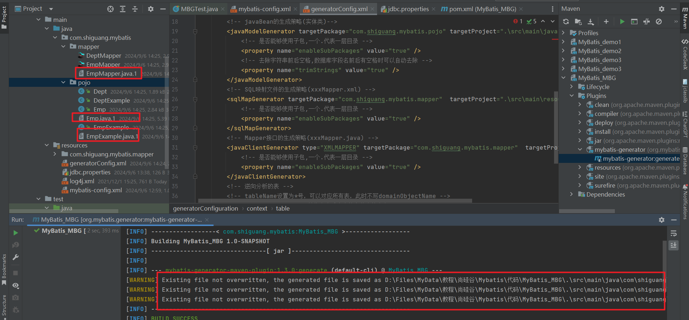


# 分页插件

## 分页插件使用步骤

### 添加依赖

```xml
<!-- 分页插件 -->
<dependency>
    <groupId>com.github.pagehelper</groupId>
    <artifactId>pagehelper</artifactId>
    <version>5.2.0</version>
</dependency>
```

### 配置分页插件

```xml
<plugins>
    <!--设置分页插件-->
    <plugin interceptor="com.github.pagehelper.PageInterceptor"/>
</plugins>
```

### 分页插件的使用

1、在查询功能之前使用`PageHelper.startPage(int pageNum,int pageSize)`开启分页功能

> pageNum：当前页的页码
> pageSize：每页显示的条数

2、在查询获取list集合之后，使用`Pagelnfo<T>pagelnfo=new Pagelnfo<>(List<T>list,int
navigatePages)`获取分页相关数据

> list：分页之后的数据
> navigatePages：导航分页的页码数

3、分页相关数据

> pageNum：当前页的页码
> pageSize：每页显示的条数
> size：当前页显示的真实条数
> total：总记录数
> pages：总页数
> prePage：上一页的页码
> nextPage：下一页的页码
> isFirstPage/isLastPage：是否为第一页/最后一页
> hasPreviousPage/hasNextPage：是否存在上一页/下一页
> navigatePages：导航分页的页码数
> navigatepageNums：导航分页的页码，[1,2,3,4,5]

### 测试

```java
public class PageHelperTest {

    /**
     * limit index,pageSize
     * index:当前页的起始索引
     * pageSize：每页显示的条数
     * pageNum：当前页的页码
     * index=(pageNum-1)*pageSize
     *
     * 使用MyBatis的分页插件实现分页功能：
     * 1、需要在查询功能之前开启分页
     * PageHelper.startPage(int pageNum, int pageSize);
     * 2、在查询功能之后获取分页相关信息
     * PageInfo<Emp> page = new PageInfo<>(list, 5);
     * list表示分页数据
     * 5表示当前导航分页的数量
     */

    @Test
    public void testPageHelper(){
        try {
            InputStream is = Resources.getResourceAsStream("mybatis-config.xml");
            SqlSessionFactory sqlSessionFactory = new SqlSessionFactoryBuilder().build(is);
            SqlSession sqlSession = sqlSessionFactory.openSession(true);
            DeptMapper mapper = sqlSession.getMapper(DeptMapper.class);
            //Page<Object> page = PageHelper.startPage(2, 4);
            PageHelper.startPage(6, 4);
            List<Dept> list = mapper.selectByExample(null);
            PageInfo<Dept> page = new PageInfo<>(list, 5);
            //list.forEach(emp -> System.out.println(emp));
            System.out.println(page);
        } catch (IOException e) {
            e.printStackTrace();
        }

    }

}
```

结果：

```bash
PageInfo{pageNum=6, pageSize=4, size=0, startRow=0, endRow=0, total=2, pages=1, list=Page{count=true, pageNum=6, pageSize=4, startRow=20, endRow=24, total=2, pages=1, reasonable=false, pageSizeZero=false}[], prePage=5, nextPage=0, isFirstPage=false, isLastPage=false, hasPreviousPage=true, hasNextPage=false, navigatePages=5, navigateFirstPage=1, navigateLastPage=1, navigatepageNums=[1]}
```

